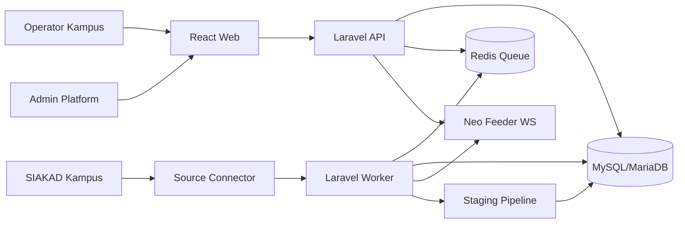
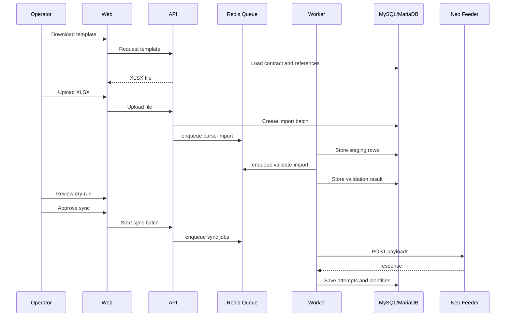
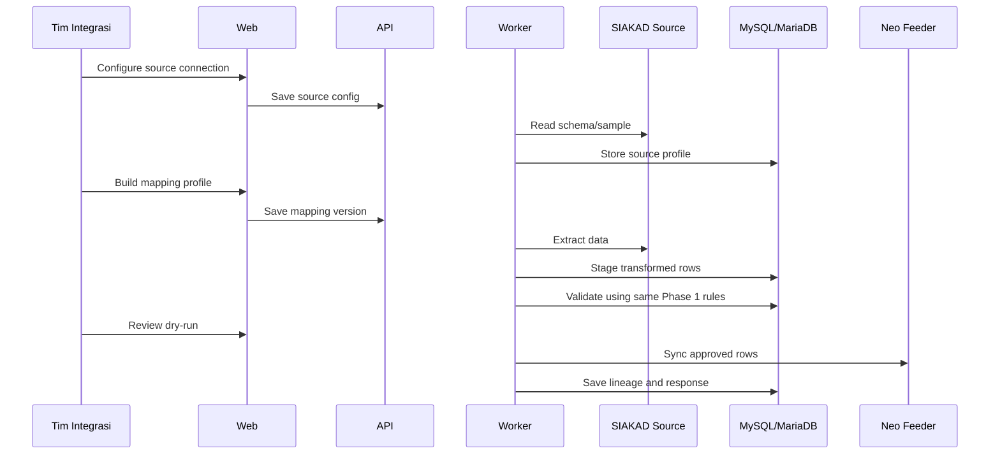

# Architecture - Bridge Neo Feeder

## 1. Keputusan Arsitektur

Rekomendasi: frontend dan backend dipisah secara aplikasi/runtime. Untuk MVP, keduanya boleh berada dalam satu workspace agar dokumen, contract, dan perubahan API mudah dijaga. Jika tim sudah terpisah, struktur ini siap dipisah menjadi dua repo.

Struktur runtime:

```text
frontend/      React + Vite dashboard
backend/       Laravel API, queue worker, scheduler, contract, validator, mapper
cookbook/      dokumen produk, arsitektur, schema, dan backlog
```

Alasan:

- Upload Excel, validasi batch, dan post Neo Feeder bisa berjalan lama.
- Laravel Queue dan Scheduler cocok untuk retry, batch import, dan sync otomatis walaupun user menutup browser.
- Contract dan validator harus dipakai bersama oleh Excel import dan otomatisasi SIAKAD di backend.
- Pemisahan runtime memudahkan deploy VPS dan debugging.
- MySQL/MariaDB selaras dengan banyak lingkungan SIAKAD lama sehingga tim kampus lebih familiar saat troubleshooting.

## 2. Stack Rekomendasi

- Frontend: React + Vite.
- Backend: Laravel.
- Worker: Laravel Queue Worker.
- Scheduler: Laravel Scheduler.
- Database aplikasi: MySQL 8 atau MariaDB 10.6+.
- Queue: Redis.
- ORM: Eloquent ORM dan Query Builder.
- Excel: `maatwebsite/excel` atau PhpSpreadsheet.
- Auth: Laravel Sanctum atau session/JWT berbasis role tenant.
- Deployment awal: Docker Compose di VPS.

Catatan database:

- Neo Feeder sendiri dari sumber instalasi publik tampak memakai PostgreSQL, tetapi aplikasi kita tetap memakai Web Service sebagai kontrak resmi.
- Database Bridge tidak perlu sama dengan database internal Neo Feeder.
- Bridge memakai MySQL/MariaDB untuk menyimpan staging, mapping, audit, payload JSON, dan status sync.
- Jangan tulis langsung ke database Neo Feeder.

## 3. High-Level Diagram



Catatan:

- API boleh melakukan test koneksi dan read kecil ke Neo Feeder.
- Import besar, reference sync, post batch, retry, dan automation sync harus lewat worker.

## 4. Runtime Responsibility

### frontend

Tanggung jawab:

- login,
- dashboard tenant,
- konfigurasi Neo Feeder,
- download template,
- upload Excel,
- preview validasi,
- dry-run payload,
- mapping UI untuk Phase 2,
- monitoring batch dan job,
- audit viewer.

Tidak menangani:

- parsing file besar langsung di browser sebagai sumber kebenaran,
- post Neo Feeder langsung,
- penyimpanan token/kredensial.

### backend - Laravel API

Tanggung jawab:

- auth dan authorization,
- REST/JSON API untuk web,
- upload file endpoint,
- membuat batch import,
- membaca staging dan hasil validasi,
- dispatch Laravel queue jobs,
- manajemen contract,
- manajemen tenant,
- enkripsi/dekripsi credential via service internal.

### backend - Laravel Worker

Tanggung jawab:

- parse Excel,
- generate template jika dilakukan async,
- sync referensi Neo Feeder,
- validasi batch,
- resolve reference,
- build payload,
- post ke Neo Feeder,
- retry,
- scheduled source sync,
- simpan request/response.

### backend - Domain Services

Tanggung jawab:

- contract channel Neo Feeder,
- field schema,
- validator,
- normalizer,
- reference resolver,
- payload builder,
- dependency graph,
- Neo Feeder client,
- mapping transform engine.

### backend - Database Layer

Tanggung jawab:

- Laravel migrations,
- Eloquent models,
- query builder,
- repository/service classes untuk query kompleks.

## 5. Neo Feeder Integration

## 5.1 Endpoint

Dokumen WS menggunakan endpoint umum:

```text
POST http://localhost:8082/ws/live2.php
```

Di aplikasi, endpoint harus dikonfigurasi per tenant karena host/port/proxy bisa berbeda.

## 5.2 Token Flow

Alur:

1. API/worker mengirim username dan password ke `GetToken`.
2. Neo Feeder mengembalikan token di `data.token`.
3. Token disimpan sementara di secure cache, bukan sebagai plain text permanen.
4. Jika token invalid/expired, worker refresh token.

## 5.3 Payload Pattern

Pola read/list:

```json
{
  "act": "GetProdi",
  "token": "...",
  "filter": "",
  "order": "",
  "limit": "100",
  "offset": "0"
}
```

Pola insert:

```json
{
  "act": "InsertBiodataMahasiswa",
  "token": "...",
  "record": {
    "nama_mahasiswa": "Nama",
    "jenis_kelamin": "L"
  }
}
```

Pola update:

```json
{
  "act": "UpdateBiodataMahasiswa",
  "token": "...",
  "key": {
    "id_mahasiswa": "uuid"
  },
  "record": {
    "nama_mahasiswa": "Nama Baru"
  }
}
```

Pola delete:

```json
{
  "act": "DeleteBiodataMahasiswa",
  "token": "...",
  "key": {
    "id_mahasiswa": "uuid"
  }
}
```

Catatan trial:

- Bentuk payload final harus diverifikasi pada token trial karena beberapa operasi dokumen menampilkan struktur khusus seperti `record object[]`.
- Contract internal harus bisa override payload builder per operasi.

## 5.4 Response Pattern

Respons umum:

```json
{
  "error_code": "0",
  "error_desc": "",
  "data": {}
}
```

Rule:

- `error_code == "0"` dianggap sukses.
- `error_code != "0"` dianggap gagal dan tidak boleh dianggap partial success tanpa bukti response.
- Simpan raw request dan raw response.
- Ambil ID hasil dari `data` jika tersedia, misalnya `id_mahasiswa`, `id_registrasi_mahasiswa`, `id_matkul`, atau `id_kelas_kuliah`.

## 6. Phase 1 Data Flow - Excel



## 7. Phase 2 Data Flow - Automation



Prinsip penting:

- Phase 2 tidak membuat pipeline baru untuk post data.
- Source connector hanya menggantikan proses isi/upload Excel.
- Setelah data masuk staging, semua validasi dan sync memakai mesin yang sama dengan Phase 1.

## 8. Core Components

## 8.1 Contract Registry

Menyimpan definisi kanal dan operasi Neo Feeder:

- channel key,
- sheet name,
- insert/update/delete/read actions,
- fields,
- references,
- validators,
- primary keys,
- dependencies,
- payload strategy.

Sumber contract:

- definisi internal berdasarkan dokumen guide WS,
- hasil `GetDictionary` dari Neo Feeder tenant,
- override manual jika versi runtime berbeda dari dokumen.

## 8.2 Reference Cache

Menyimpan lookup dari endpoint referensi:

- prodi,
- semester,
- agama,
- negara,
- wilayah,
- jenis tinggal,
- alat transportasi,
- jenis pendaftaran,
- jalur masuk,
- pembiayaan,
- status mahasiswa,
- jenis keluar,
- dosen,
- penugasan dosen,
- mata kuliah,
- kelas kuliah.

Reference cache bersifat per tenant.

## 8.3 Template Service

Membuat workbook Excel dari contract:

- sheet data per kanal,
- sheet referensi,
- kolom wajib diberi tanda,
- komentar/notes field,
- dropdown untuk referensi kecil,
- instruksi format tanggal,
- template version.

## 8.4 Import Service

Tanggung jawab:

- simpan file upload,
- parse workbook,
- deteksi sheet hilang,
- normalisasi cell kosong,
- normalisasi tanggal,
- simpan raw row dan normalized row.

## 8.5 Validation Engine

Validasi:

- required,
- type,
- length,
- enum,
- date,
- numeric precision,
- reference existence,
- local dependency,
- duplicate within batch,
- existing identity conflict.

Output:

- errors: harus diperbaiki sebelum sync.
- warnings: boleh dilanjutkan dengan approval.
- info: catatan non-blocking.

## 8.6 Resolver

Resolver mengubah input manusia/source menjadi ID Neo Feeder.

Contoh:

- kode prodi atau nama prodi menjadi `id_prodi`,
- kode mata kuliah menjadi `id_matkul`,
- NIM menjadi `id_registrasi_mahasiswa`,
- NIDN/nama dosen menjadi `id_dosen` atau `id_registrasi_dosen`,
- semester menjadi `id_semester`.

Jika hasil resolve lebih dari satu, status harus ambiguous dan butuh review.

## 8.7 Sync Dispatcher

Tanggung jawab:

- menentukan urutan post,
- membuat payload,
- mengirim ke Neo Feeder,
- menyimpan attempts,
- menangani retry,
- menyimpan ID hasil,
- memperbarui status staging.

## 8.8 Audit Logger

Audit minimal:

- login,
- perubahan tenant config,
- credential update,
- reference refresh,
- template generation,
- upload,
- validation,
- approval sync,
- post attempt,
- retry,
- mapping profile change,
- automation schedule change.

## 9. Logical Database Modules

### Identity And Access

- users,
- roles,
- tenant_memberships,
- sessions/audit tokens.

### Tenant

- tenants,
- neofeeder_connections,
- neofeeder_token_cache.

### Contract

- contract_versions,
- channel_contracts,
- operation_contracts,
- field_contracts,
- reference_contracts.

### Reference

- reference_snapshots,
- reference_records.

### Template And Import

- template_versions,
- import_batches,
- uploaded_files,
- staging_records,
- staging_field_values,
- validation_results.

### Sync

- sync_batches,
- sync_jobs,
- sync_attempts,
- sync_identities,
- sync_dependencies.

### Automation

- source_connections,
- source_profiles,
- source_tables,
- source_fields,
- mapping_profiles,
- mapping_rules,
- transform_runs,
- automation_schedules.

### Audit

- audit_logs,
- sensitive_access_logs.

## 10. Queue Jobs

Initial job list:

- `neofeeder.testConnection`
- `neofeeder.refreshToken`
- `neofeeder.syncReferences`
- `template.generate`
- `import.parseWorkbook`
- `import.validateBatch`
- `sync.prepareBatch`
- `sync.dispatchRecord`
- `sync.retryFailed`
- `automation.discoverSource`
- `automation.extractSource`
- `automation.transformToStaging`
- `automation.scheduledSync`

## 11. Idempotency

Setiap staging record perlu key idempotency:

```text
tenant_id + channel + natural_key + operation + source_batch_id
```

Natural key contoh:

- biodata mahasiswa: NIK atau kombinasi nama, tanggal lahir, nama ibu jika NIK belum ada.
- riwayat pendidikan: NIM + id_prodi + id_periode_masuk.
- mata kuliah: kode_mata_kuliah + id_prodi.
- kelas kuliah: id_semester + id_prodi + id_matkul + nama_kelas_kuliah.
- peserta kelas: id_kelas_kuliah + id_registrasi_mahasiswa.
- nilai: id_kelas_kuliah + id_registrasi_mahasiswa.
- AKM: id_registrasi_mahasiswa + id_semester.

Jika identity Neo Feeder sudah ada, sistem memilih update atau skip sesuai mode yang dipilih.

## 12. Error Handling

Kategori error:

- file error,
- sheet error,
- field validation error,
- reference resolution error,
- dependency error,
- Neo Feeder request error,
- Neo Feeder business error,
- timeout/network error,
- ambiguous mapping error.

Retry hanya otomatis untuk:

- timeout,
- network temporary failure,
- token expired setelah refresh token,
- HTTP 5xx dari proxy.

Retry tidak otomatis untuk:

- validation error,
- reference not found,
- duplicate/ambiguous match,
- `error_code` bisnis dari Neo Feeder.

## 13. Security Architecture

- Credential Neo Feeder dienkripsi sebelum masuk database.
- Secret key berasal dari environment VPS.
- Token cache punya TTL.
- Role dan tenant scoping diterapkan di API.
- File upload disimpan dengan path opaque.
- Sensitive fields bisa dimasking di UI.
- Raw payload hanya bisa dilihat role tertentu.
- Semua sync approval tercatat.

## 14. Deployment VPS

Docker Compose awal:

```text
web
api
worker
mysql
redis
nginx/caddy
```

Environment:

```text
DB_CONNECTION=mysql
DB_HOST
DB_PORT
DB_DATABASE
DB_USERNAME
DB_PASSWORD
REDIS_URL
APP_KEY
CREDENTIAL_ENCRYPTION_KEY
VITE_API_BASE_URL
NEOFEEDER_DEFAULT_TIMEOUT_MS
UPLOAD_MAX_SIZE_MB
```

Trial:

- pakai tenant dummy,
- pakai credential/token trial,
- mulai dari satu kanal kecil,
- jalankan post satu record,
- verifikasi response dan ID write-back.

## 15. Observability

Minimal:

- structured logs,
- job status,
- job duration,
- Neo Feeder latency,
- error_code frequency,
- import success rate,
- sync success rate,
- reference refresh age.

Dashboard:

- batch terbaru,
- queue health,
- error per kanal,
- retry pending,
- referensi terakhir refresh,
- koneksi Neo Feeder.
